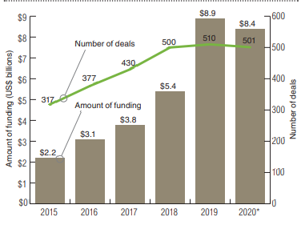
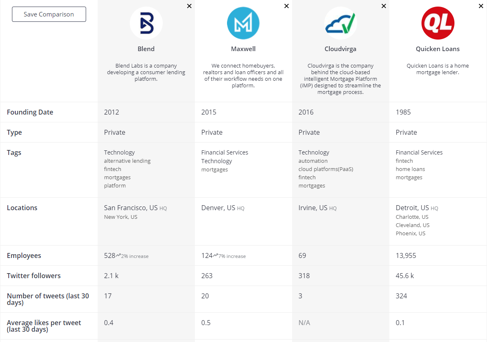

# Blend Company - Case Study
## **Overview and Origin**

Blend Company is a real estate tech startup headquartered in San Francisco and founded in 2012 by Nima Ghamsari and Rosco Hill. The company is privately held and led by President, Tim Mayopoulos. Blend helps lenders streamline the customer journey for any banking product from application to close. Its Digital Lending Platform is used by Wells Fargo, U.S. Bank, and over 250 other leading financial institutions to acquire more customers, increase productivity, and deepen customer relationships. The company enables customers to process more than $3.5 billion in mortgages and consumer loans per day, helping millions of consumers get into homes and gain access to the capital they need to lead better lives.

The CEO Nina Ghamsari came up with the idea with his co-founders as they were seeking a platform that would assist customers in building a product that eased the simplicity and transparency through data and digitization. A platform approach was key and allowed her team to serve the process end-to-end, guiding both customer and lender through a typically complex process, including eligibilty, data collection and verification, and third party integrations. 

The Company started with an initial VC capital raise of $160MM with a market valuation of $500MM led by Greylock Partners, and Lightspeed Venture Partnes. This past August, the company raised an additional $75MM in a Series F round led by Canapi Ventures. Thus far, Blend has raised a total of $365MM in venture capital to date with a current valuation of $1.7 billion.

## **Business Activities**

Blend got into the business with the intention of specifically fulfilling a void in the market. Which is to provide banks, lenders and consumers with a digital closing solution for mortgages and home equity loans. Using data-driven process automation, the company aims to eliminate and automate tasks for conditioning, fulfillment and closing. Blend connects borrowers, loan teams, settlement agents and real estate agents all on one platform in order to streamline application processes and close deals faster. 

Blend's intended customer is more than 250 financial institutions including Wells Fargo and U.S. Bank, which collectively have processed more than $3.5 billion in consumer loans per day. Recently, the company expanded its range of financial offerings to include consumer banking with the introduction of auto loans. They have also partnered with M&T Bank to help process loan applications for the Small Business Administration’s Paycheck Protection Program.

Blend stands out from its competitors by inviting companies that service the mortgage industry to sell digital tools--APIs--through its platform. This has the potential to speed up the pace of change in an industry that still relies heavily on e-mailed PDFs and spreadsheets. Without Blend, its competitors will often face issues in their platforms. For example, when opening the application to apply for a loan, many mortgage software solutions will take the user off of the bank’s website to a completely different URL. This experience can create concern or decrease the user’s trust in the process. It is essential to ensure the borrower feels secure when sharing their personal information. eClose scenarios are another common example of a fragmented customer experience, as the fully digital end-to-end mortgage experience gains steam. There are not many mortgage platforms that allow borrowers to start the application and move all the way through the process within one portal. Not only is the experience inconsistent, but it also creates a headache for borrowers with more usernames and passwords required. 

The technology that Blend uses is known as white label mortgage apps, and it allows financial institutions to deliver a cohesive experience from end to end, with minimal disruptions. The highly branded and familiar experience is designed to put members at ease and remove any potential friction from the process. It gives consumers flexibility to close the way they want. The single, integrated experience offers all of the necessary functionality for eSign, Remote Online Notarization, eNote solutions, integration to an eVault, and eRecording. 

## **Landscape**

The domain of the financial industry that Blend is categorized in is Real Estate Tech or Proptech as its also known. After years of talking about how the real estate industry was on the cusp of proptech adoption, digitization has truly accelerated during the pandemic. But once again, the conversation has shifted. While part of what had been fueling investments and new funds to accelerate proptech was a fear of missing out on this emerging trend, the tone of the discussion in 2020 reflects
a more cautious approach as funding is projected to fall slightly
to US$8.4 billion in 2020 after years of rapid growth (see ExhibitA). With companies paying close attention to costs, the focus
now is on necessity rather than finding the next unicorn.

#### _Real Estate Tech Global Financing History_

#### Trends in Residential Real Estate Tech
* Significant changes in the residential real estate marketplace that are driving the current wave of disruptive startups are Demographic chagnes and Transaction preferences. 

#### Trends encouraging disruption - Affordability
* Millennials spend a greater share of their household income on rent than previous generations did at the same age.
* More Millennials live at home with their parents.
* The share of Americans who got married, had kids, got a job and lived on their own by age 34 fell from 45% in 1975 to 24% in 2016.
* In several areas with the greatest concentrations of desirable, high paying jobs, home ownerships is out of the question for middle class wage earners. San Francisco, the median sale price of a home is $1.36MM.
* Divvy - markets rent-to-own homes, an alternative to mortgages for those with low credit scores. 
* Bungalow - a combination property manager and roommate-finding service managing urban group homes. 

#### Trends encouraging disruption - A Search for Community
* Millennials are the first to experience the workforce wholly within the prism of smartphones and 24/7 connectivity.
* The focus on digital community comes at th expense of traditional community activity, they attempt to facilitate community involvement. 

#### Trends encouraging disruption - Flexibility
* The "Gig Economy", largely enabled by tech, has highlighted the increased salience of flexibility for workers and consumers alike.
* Furniture rentals
* * Feather, Fernish and CasaOne with online shopping and offline delivery.
* * Knock buys a new home for a customer, for cash, before the customer lists their old home.
* * Helps with renovations and financing

Other major companies in this domain include:

## **Results**

The business impact to the industry for Blend has been enormous. It was one of the few in 2019 that had a huge seed and series raise. It has raised $365MM to date with a valuation of $1.7 billion. Its impact is best felt with more than 150 financial institutions, including Wells Fargo and US Bank, and claims to process nearly $3.5 billion in mortgages and consumer loans daily. The business has recently expanded its offerings to include home equity, deposit account openings and homeowners' insurance. Blend has also added former Pixar CFO Ann Mather, who also serves on the board of Alphabet, Airbnb and Netflix, to its board.  

Some of the core metrics that companies in this domain use to meaure success include efficiencies, profitability, and margins from increased efficiencies often through disintermediating humans. Other metrics used are amount of consumer transactions per day, clicks and consumer awareness indices. Overall, Blend ranked high compared to its peers as revenue is around $70MM over the last few years, this based from Bloomberg data. However, its difficult to acertain other financial metrics since the company is private and financial information is limited. 

## **Recommendations**

Blend currently is a company with mostly lenders as its customers. I would advise Blend to consider developing a platform specifically targeting homeonwers directly. They can sell B2C (Business to Customer) and use its relationships with lenders to channel business to them. I believe this service would benefit the company because it will increase their margins and get them into a segment that is constantly growing. 

Housing Sales will end 2020 on a Solid Footing:
*  Housing starts rose 4.9% to 1.53 million annualized units in October. Total starts were 2.8% a year ago. 
* Single-family starts rose 6.4% - the highest reading since 2007.
* New home sales remain strong, despite slipping a bit in October
* Home prices continue to rise amid the shortage in inventory.

The residential housing market is booming, and I would advise Blend to consider adding this segment to its services so they can maximize their business model with a new revenue stream. The new technologies they can can utilize would be AI and Machine Learning. The Housing market is an industry with a vast amount of data and available resources from various government housing authorities. They can utilize this vast data by evaluating and analyzing it with these new technologies so that they can tailor its services to the new segment in different parts of the country. 

---
## Sources & References
* Blend Blog - https://blend.com/blog/insights/
* Blend Company - https://blend.com/company/about/
* Builtin SF - www.builtinsf.com/2020/08/13blend-raises-75m-1b-valuation
* Crunchbase - www.crunchbase.com/organization/blend-labs
* Forbes Fintech 50 Feb 2020 - www.forbes.com/fintech/2019/#4669ed202b4c
* Kiplinger - https://www.kiplinger.com/economic-forecasts/housing
* Pitchbook - https://pitchbook.com/news/articles/blend-becomes-latest-fintech-startup-to-bank-a-mega-round-in-2019 
* PWC Emerging Trends in Real Estate - https://www.pwc.com/us/en/asset-management/real-estate/assets/pwc-emerging-trends-in-real-estate-2021.pdf
* Wharton University of Pennsylvania - Application of AI, Insurtech and Real Estate Technology: Trends in Residential Real Estate Tech by Professor Christopher Geczy, PhD (Power point)

---

#### Fintech Class - Rice University
#### Harry Torres
#### December 13, 2020
